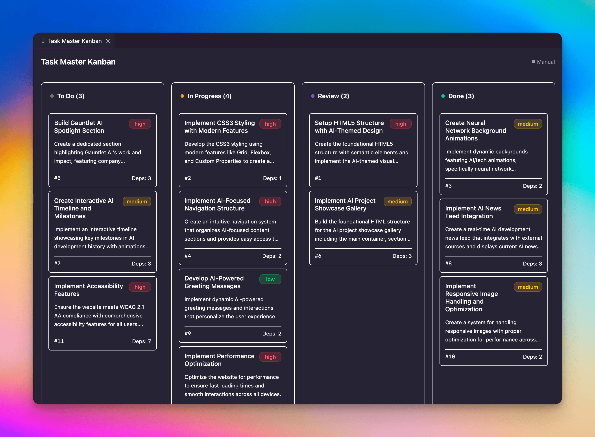
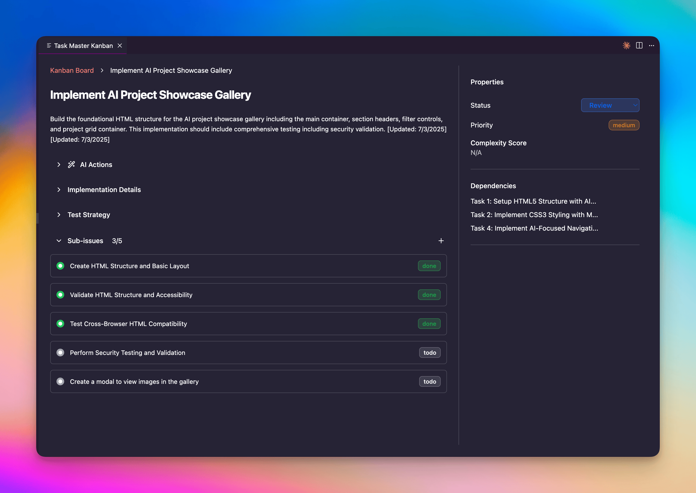

# Official Taskmaster AI Extension

Transform your AI-driven development workflow with a beautiful, interactive Kanban board directly in VS Code. Seamlessly manage tasks from [Taskmaster AI](https://github.com/eyaltoledano/claude-task-master) projects with real-time synchronization and intelligent task management.


## 🎯 What is Taskmaster AI?

Taskmaster AI is an intelligent task management system designed for AI-assisted development. It helps you break down complex projects into manageable tasks, track progress, and leverage AI to enhance your development workflow.

## ✨ Key Features

### 📊 **Interactive Kanban Board**
- **Drag & Drop Interface** - Effortlessly move tasks between status columns
- **Real-time Sync** - Changes instantly reflect in your Taskmaster project files
- **Multiple Views** - Board view and detailed task sidebar
- **Smart Columns** - Pending, In Progress, Review, Done, Deferred, and Cancelled



### 🤖 **AI-Powered Features**
- **Task Content Generation** - Regenerate task descriptions using AI
- **Smart Task Updates** - Append findings and progress notes automatically
- **MCP Integration** - Seamless connection to Taskmaster AI via Model Context Protocol
- **Intelligent Caching** - Smart performance optimization with background refresh



### 🚀 **Performance & Usability**
- **Offline Support** - Continue working even when disconnected
- **Auto-refresh** - Automatic polling for task changes with smart frequency
- **VS Code Native** - Perfectly integrated with VS Code themes and UI
- **Modern Interface** - Built with ShadCN UI components and Tailwind CSS

## 🛠️ Installation

### Prerequisites

1. **VS Code** 1.90.0 or higher
2. **Node.js** 18.0 or higher (for Taskmaster MCP server)

### Install the Extension

1. **From VS Code Marketplace:**
   - Click the **Install** button above
   - The extension will be automatically added to your VS Code instance

## 🚀 Quick Start

### 1. **Initialize Taskmaster Project**
If you don't have a Taskmaster project yet:
```bash
cd your-project
npm i -g task-master-ai
   task-master init
   ```

### 2. **Open Kanban Board**
- **Command Palette** (Ctrl+Shift+P): `Taskmaster Kanban: Show Board`
- **Or** the extension automatically activates when you have a `.taskmaster` folder in your workspace

### 3. **MCP Server Setup**
The extension automatically handles the Taskmaster MCP server connection:
- **No manual installation required** - The extension spawns the MCP server automatically
- **Uses npx by default** - Automatically downloads Taskmaster AI when needed
- **Configurable** - You can customize the MCP server command in settings if needed

### 4. **Start Managing Tasks**
- **Drag tasks** between columns to change status
- **Click tasks** to view detailed information
- **Use AI features** to enhance task content
- **Add subtasks** with the + button on parent tasks

## 📋 Usage Guide

### Task Management

| Action | How to Do It |
|--------|--------------|
| **View Kanban Board** | `Ctrl/Cmd + Shift + P` → "Taskmaster: Show Board" |
| **Change Task Status** | Drag task card to different column |
| **View Task Details** | Click on any task card |
| **Edit Task Content** | Click task → Use edit buttons in details panel |
| **Add Subtasks** | Click the + button on parent task cards |
| **Use AI Features** | Open task details → Click AI action buttons |

### Understanding Task Statuses

- 📋 **Pending** - Tasks ready to be started
- 🚀 **In Progress** - Currently being worked on
- 👀 **Review** - Awaiting review or feedback
- ✅ **Done** - Completed tasks
- ⏸️ **Deferred** - Postponed for later

### **AI-Powered Task Management**

The extension integrates seamlessly with Taskmaster AI via MCP to provide:
- **Smart Task Generation** - AI creates detailed implementation plans
- **Progress Tracking** - Append timestamped notes and findings
- **Content Enhancement** - Regenerate task descriptions for clarity
- **Research Integration** - Get up-to-date information for your tasks

## ⚙️ Configuration

Access settings via **File → Preferences → Settings** and search for "Taskmaster":

### **MCP Connection Settings**
- **MCP Server Command** - Path to task-master-ai executable (default: `npx`)
- **MCP Server Args** - Arguments for the server command (default: `-y`, `--package=task-master-ai`, `task-master-ai`)
- **Connection Timeout** - Server response timeout (default: 30s)
- **Auto Refresh** - Enable automatic task updates (default: enabled)

### **UI Preferences**
- **Theme** - Auto, Light, or Dark mode
- **Show Completed Tasks** - Display done tasks in board (default: enabled)
- **Task Display Limit** - Maximum tasks to show (default: 100)

### **Performance Options**
- **Cache Duration** - How long to cache task data (default: 5s)
- **Concurrent Requests** - Max simultaneous API calls (default: 5)

## 🔧 Troubleshooting

### **Extension Not Loading**
1. Ensure Node.js 18+ is installed
2. Check workspace contains `.taskmaster` folder
3. Restart VS Code
4. Check Output panel (View → Output → Taskmaster Kanban)

### **MCP Connection Issues**
1. **Command not found**: Ensure Node.js and npx are in your PATH
2. **Timeout errors**: Increase timeout in settings
3. **Permission errors**: Check Node.js permissions
4. **Network issues**: Verify internet connection for npx downloads

### **Tasks Not Updating**
1. Check MCP connection status in status bar
2. Verify `.taskmaster/tasks/tasks.json` exists
3. Try manual refresh: `Taskmaster Kanban: Check Connection`
4. Review error logs in Output panel

### **Performance Issues**
1. Reduce task display limit in settings
2. Increase cache duration
3. Disable auto-refresh if needed
4. Close other VS Code extensions temporarily

## 🆘 Support & Resources

### **Getting Help**
- 📖 **Documentation**: [Taskmaster AI Docs](https://github.com/eyaltoledano/claude-task-master)
- 🐛 **Report Issues**: [GitHub Issues](https://github.com/eyaltoledano/claude-task-master/issues)
- 💬 **Discussions**: [GitHub Discussions](https://github.com/eyaltoledano/claude-task-master/discussions)
- 🐛 **Report Issues**: [GitHub Issues](https://github.com/eyaltoledano/claude-task-master/issues)

## 🎯 Tips for Best Results

### **Project Organization**
- Use descriptive task titles
- Add detailed implementation notes
- Set appropriate task dependencies
- Leverage AI features for complex tasks

### **Workflow Optimization**
- Review task details before starting work
- Use subtasks for complex features
- Update task status as you progress
- Add findings and learnings to task notes

### **Collaboration**
- Keep task descriptions updated
- Use consistent status conventions
- Document decisions in task details
- Share knowledge through task notes

---

## 🏆 Why Taskmaster Kanban?

✅ **Visual workflow management** for your Taskmaster projects  
✅ **AI-powered task enhancement** built right in  
✅ **Real-time synchronization** keeps everything in sync  
✅ **Native VS Code integration** feels like part of the editor  
✅ **Free and open source** with active development  

**Transform your development workflow today!** 🚀

---

*Originally Made with ❤️ by [David Maliglowka](https://x.com/DavidMaliglowka)*

## Support

This is an open-source project maintained in my spare time. While I strive to fix bugs and improve the extension, support is provided on a best-effort basis. Feel free to:
- Report issues on [GitHub](https://github.com/eyaltoledano/claude-task-master/issues)
- Submit pull requests with improvements
- Fork the project if you need specific modifications

## Disclaimer

This extension is provided "as is" without any warranties. Use at your own risk. The author is not responsible for any issues, data loss, or damages that may occur from using this extension. Please backup your work regularly and test thoroughly before using in important projects.